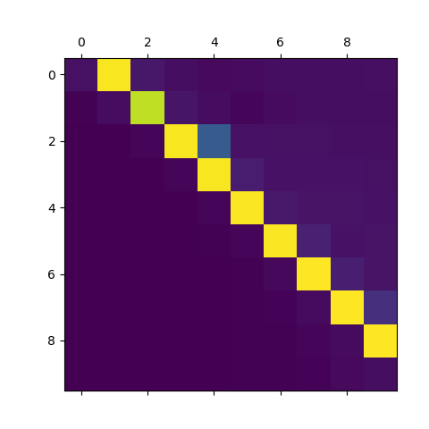

# pgn

PGN (read as pagan) is a library to build [graph networks](https://arxiv.org/abs/1806.01261) in pytorch.
If you love tensorflow, you can find the original implementation [here](https://github.com/deepmind/graph_nets).

## Example

Run `python3 sort.py` in the `examples' folder to run a sorting toy-task. You should get the results similar to the picture below.

## Acknowledgements

* [Wendelin Boehmer](https://whirl.cs.ox.ac.uk/member/wendelin-boehmer/) for useful discussions and trying it out.
* [Matthias Fey](https://github.com/rusty1s) for his great pytorch-scatter library.
